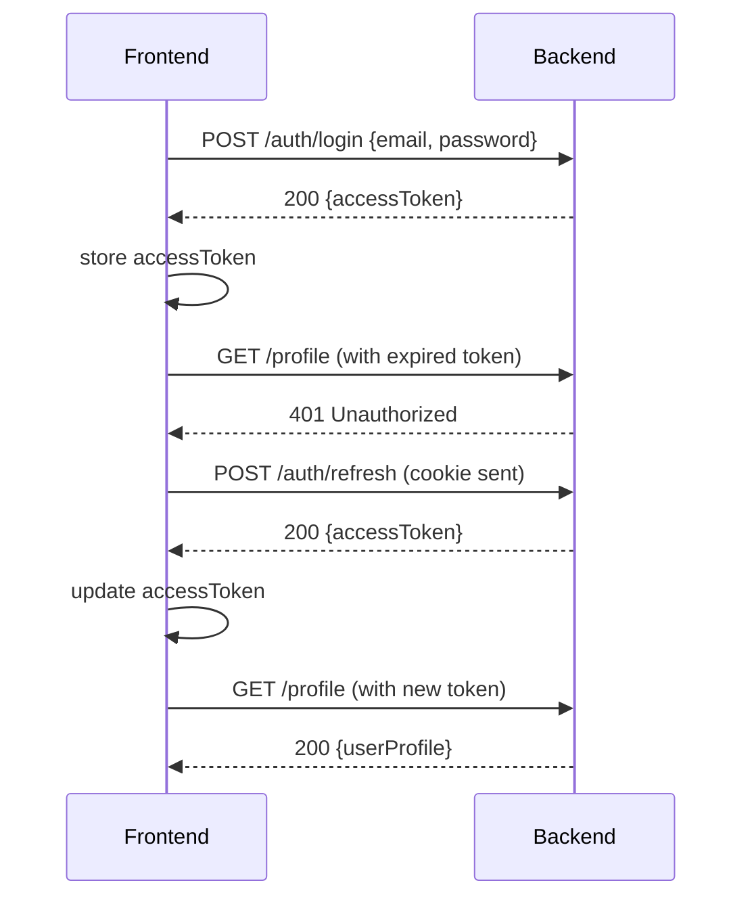

# AI-Note-APP-API

## Tools & Tech ⛏


## Authentication Flow & Error Handling Guide for Frontend

This guide outlines how our backend and frontend coordinate for JWT-based authentication, covering public vs. protected routes, token management, middleware logic, frontend integration, and a sequence diagram.

---

### 1. Public vs. Protected Routes

- **Public Endpoints**:
  - `/auth/login`
  - `/auth/register`
  These routes are accessible without a valid **accessToken**.

- **Protected Endpoints**:
  - All other API routes that marked as **protected**.
  - Require a valid **accessToken** in the `Authorization` header.

---

### 2. Token Types, Lifetimes, and Storage

| Token Type     | Lifetime      | Storage              | Sent via                              |
|----------------|---------------|----------------------|---------------------------------------|
| **Access Token**  | Short (e.g. 5m) | in-memory | `Authorization: Bearer <accessToken>` header |
| **Refresh Token** | Long (e.g. 7d) | HTTP-only, Secure **cookie** scoped to `/auth/refresh` | Browser sends cookie automatically on `/auth/refresh` |

> **Security Note:** Refresh tokens are never exposed to JavaScript. Access tokens are kept minimal and short-lived.

---

### 3. Middleware Logic (`blockIfAuthenticated`)

Applied on public routes (`/login`, `/register`) to prevent already-authenticated users from re-authenticating:

1. **Check for `Authorization` header**:
   - No header → `next()` (allow).
2. **Verify `accessToken`**:
   - **Valid** → respond `403 Forbidden` with `{ code: "FORBIDDEN", message: "Authenticated users cannot access this endpoint." }`.
   - **Expired or invalid** → `next()` (treat as unauthenticated).

> **Frontend Note:** Before each request, the front end should avoid attaching an expired or invalid access token. If it’s expired, trigger the refresh flow instead of sending it to the server.

This ensures only valid active sessions are blocked, while expired tokens let users re-login or register.

---

### 4. Frontend Responsibilities

#### 4.1 Attaching Access Token

Configure your HTTP client (e.g. Axios) to include the access token on protected requests:

```js
import axios from 'axios';

const api = axios.create({
  baseURL: process.env.API_URL,
  withCredentials: true, // if using cookie-based refresh
});

api.interceptors.request.use(config => {
  const token = localStorage.getItem('accessToken');
  if (token) {
    config.headers.Authorization = `Bearer ${token}`;
  }
  return config;
});

export default api;
```

#### 4.2 Handling `401 Unauthorized`

On any 401 response from a protected endpoint, attempt a token refresh before redirecting to login:

```js
api.interceptors.response.use(
  response => response,
  async error => {
    const originalRequest = error.config;

    if (error.response?.status === 401 && !originalRequest._retry) {
      originalRequest._retry = true;
      try {
        const { data } = await api.post('/auth/refresh');
        localStorage.setItem('accessToken', data.accessToken);
        originalRequest.headers.Authorization = `Bearer ${data.accessToken}`;
        return api(originalRequest);
      } catch (refreshError) {
        // Refresh failed: clear tokens and redirect
        localStorage.removeItem('accessToken');
        window.location.href = '/login';
      }
    }
    return Promise.reject(error);
  }
);
```

#### 4.3 Refresh Flow

1. **On 401**, call `/auth/refresh` once with `{ withCredentials: true }`.
2. **If successful**, store new `accessToken` and retry original request.
3. **If failed**, clear storage and navigate to `/login`.

#### 4.4 Login/Register Flow

- Send email/password to `/auth/login` or `/auth/register`.
- Backend returns `{ accessToken }` on success.
- **Store** `accessToken` in `localStorage` (or preferred storage).

```js
async function login(credentials) {
  const { data } = await api.post('/auth/login', credentials);
  localStorage.setItem('accessToken', data.accessToken);
  // Handle post-login initialization...
}
```

---

### 5. Sequence Diagram


